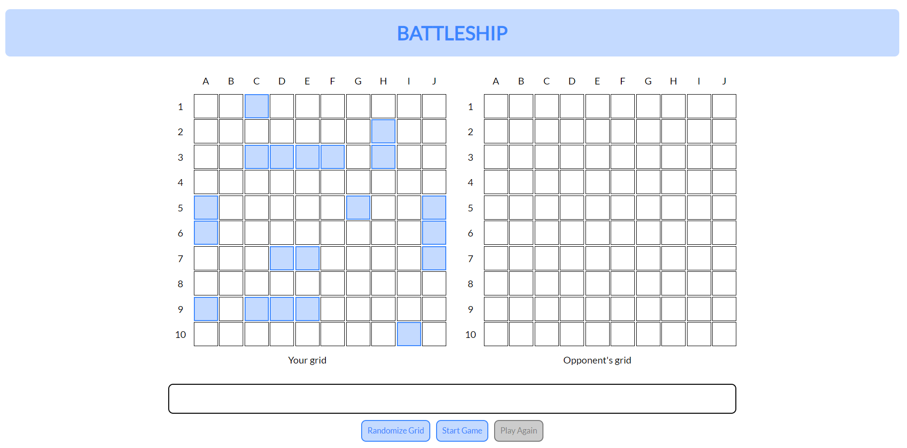

# Battleship Game

Project for [TheOdinProject](https://www.theodinproject.com/courses/javascript/) JavaScript curriculum.

The user can play Battleship against the Computer. The user and the computer will have a set of ships distributed in a grid. The first player who sinks all the other player's ships wins.

## Features

- Button to randomize the ships in the player's grid.
- Button to start the game and to play again once the game ends.
- Display box to show what is happening in the game.

## Resources

- [React](https://reactjs.org/)
- [Webpack](https://webpack.js.org/)
- [Babel](https://babeljs.io/)
- [Jest](https://jestjs.io/)
- JavaScript, CSS and HTML

## Demo

Live version [here](http://fernanda-veiga.github.io/battleship)



## How to use

To use the website, click [here](http://fernanda-veiga.github.io/battleship).

To use the code, download the files and, on the file's directory, type the following on the terminal:

```
npm install
npm run start
```
